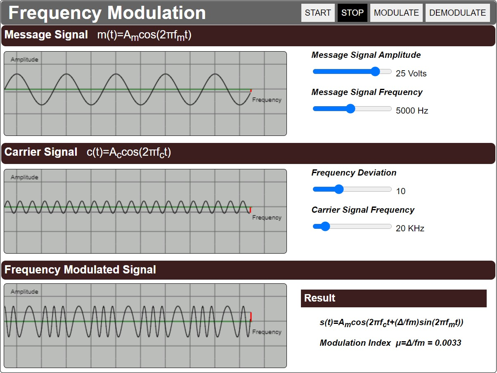
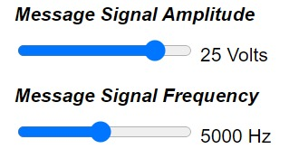
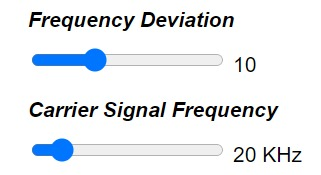
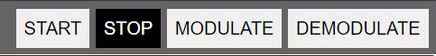

##### These procedure steps will be followed on the simulator

1. After going through the theory and pretest, click the "Simulation" tab 

2. The simulator will display the interactive Simulator 
 
3. Set the Message Signal Amplitude and Frequency 
 
4. Set the Carrier Signal Frequency and frequency deviation 
 
 
 
5. Click on "Modulate" button. This will Show the Modulated Message Signal. 
6. Click on "Demodulate" button. This will Show the Demodulated Message Signal. 
7. Click on "Stop" button to view the graph in a Statis state 

8.  The simulator will display the interactive questions, attempt the questions. 
9. Note the conclusions from the experiment performed. 
