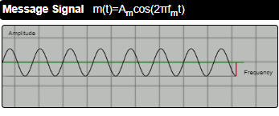
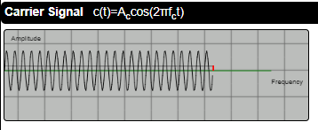
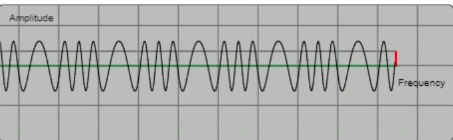
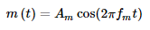
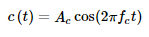
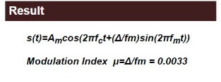

##  INTRODUCTION  

 In communication, to transfer signal from one point to another efficiently many modulation techniques are used. Frequency modulation is one of the most commonly used technique used in communication to carry message signal with help of high frequency waves.
 If the frequency of the high frequency signal is simultaneously changed to that of the modulating signal, the process is termed as Frequency Modulation.

---

## <b>CONCEPT</b> 

 Out of the three parameters in any given waveform, ie., amplitude , frequency and phase, If the frequency of message is varied with respect to the high frequency signal(Carrier) the resultant will a modulated signal. 

---

## <b>FREQUENCY MODULATION WAVE FORMS</b> 

 

  
  
  

 
Where  and  are mathematical expression for
<i>modulating and Carrier Signal</i>. 
The modulation Index can be Calculated Using the Formulae 
 

Take the pretest to Check your Understanding till know
