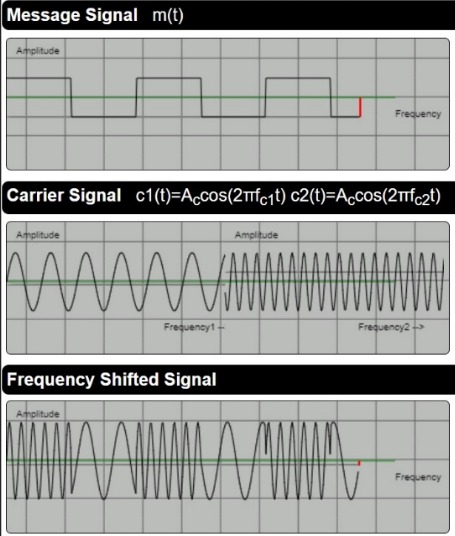
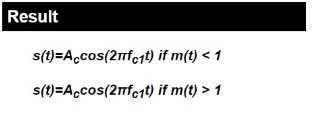

##  INTRODUCTION  

 FSK is the digital modulation technique in which the frequency of the carrier signal varies according to the digital signal changes. FSK is a scheme of frequency modulation. The output of a FSK modulated wave is high in frequency for a binary High input and is low in frequency for a binary Low input. The binary 1s and 0s are called Mark and Space frequencies.

---

## <b>AMPLITUDE MODULATION WAVE FORMS</b> 

 

  

 

The modulated signal can be Calculated Using the Formulae 
 

Take the pretest to Check your Understanding till know
