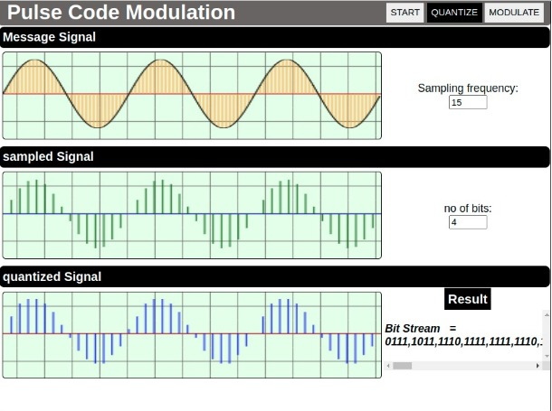
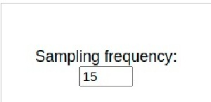
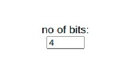
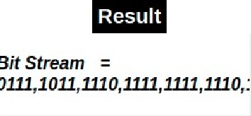

##### These procedure steps will be followed on the simulator

After reading the theory and attending the pre-test, click the "Simulation" tab
    1. The interactive simulator will be displayed
       
    2. Set the sampling frequency.
           
    3. Set the no of bits
           
           
    4. Click on "Modulate" button. This will Show the Modulated Message Signal Simulation Screen.
    5. Click on "Start" button. This will start the Simulation.
    6. Click on "Demodulate" button. This will Show the Demodulated Message Signal.
    7. Click on "Stop" button to view the graph in a Static state
           
    8. In the Results Section you can view the modulation Index and type of modulation (with respect to modulation index).
    9. The post-test questions will be displayed, attempt the questions to check the understanding about the experiment.
Note the conclusions from the experiment performed
